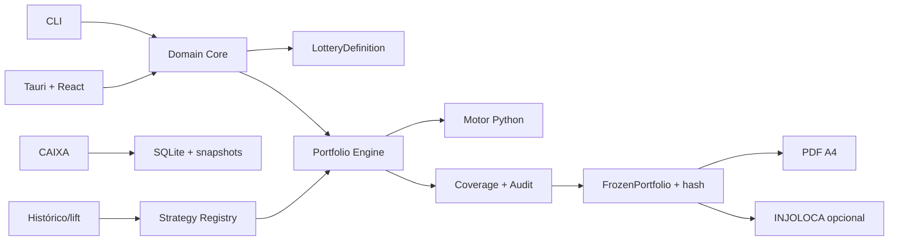

# Arquitetura Full-stack — Plataforma de Engenharia de Bolões

**Status:** Fundacional — aprovada para iniciar implementação por stories  
**Versão:** 1.0  
**Data:** 2026-08-29  
**Produto:** [PRD](prd.md) e [invariantes](architecture/product-invariants.md)

## 1. Objetivo e invariantes

O produto é uma plataforma desktop, local-first, para gerar, auditar, congelar,
imprimir e conferir carteiras. Lotofácil é a primeira modalidade; futuras
loterias reutilizam o processo, com regras, métricas, preços, resultados e
impressão próprios.

As decisões imutáveis são:

1. O fluxo é `universo -> métricas -> histórico/lift -> validação temporal -> estratégia aprovada -> geração -> otimização -> auditoria`.
2. `PortfolioGenerator` nunca lê histórico bruto: recebe somente
   `LotteryDefinition`, `ApprovedStrategyConfig` e parâmetros de execução.
3. Somente `FrozenPortfolio`, identificada por `portfolio_hash`, pode ser
   exportada, impressa, enviada ao adaptador online ou conferida.
4. A impressão A4 é um módulo de primeira classe, separado do INJOLOCA.
5. CLI é a operação primária; o desktop usa os mesmos casos de uso.

Não existem backend remoto, API pública, autenticação, pagamentos ou cadastro de
participantes no MVP.

## 2. Visão arquitetural

Monólito modular em monorepo npm workspaces. TypeScript contém domínio,
contratos, CLI, auditoria e persistência. Um processo Python local é reservado
para cálculo numérico pesado e comunica-se por JSON versionado. SQLite armazena
dados, snapshots e artefatos auditáveis.



## 3. Stack

| Área | Tecnologia | Uso |
| --- | --- | --- |
| Runtime | Node.js 24.14.0 + npm | CLI, workspaces e automação |
| Domínio | TypeScript 6.0.3 | contratos, Core, CLI e desktop |
| Desktop | Tauri 2.11.x | permissões, arquivos e empacotamento |
| Interface | React 19.2.8 + Vite 8 | operação visual posterior ao CLI |
| Dados | SQLite via better-sqlite3 13.0.3 | snapshots, configurações e auditorias |
| Cálculo pesado | Python 3.12+ + NumPy | geração, otimização e cobertura |
| Validação | Zod | comandos, snapshots e IPC |
| Testes TS/Python | Vitest 4.1.10 / pytest | unidades, integração e contratos |

Versões efetivas serão travadas no lockfile. Python 3.12+ e Rust ainda precisam
ser instalados na máquina antes da fundação do motor e desktop.

## 4. Estrutura

```text
apps/
  cli/                         # operação completa
  desktop/                     # Tauri + React
packages/
  domain-core/                 # estados, versões e hash
  lottery-contracts/           # contrato reutilizável de modalidade
  combinatorics/               # combinações e interseções
  portfolio-engine/            # geração e diversidade
  coverage-engine/             # cobertura e redundância
  audit-engine/                # auditoria
  statistics-engine/           # histórico, lift e validação
  strategy-registry/           # estados de estratégia
  data-access/                 # SQLite e snapshots
  result-ingestion/            # CAIXA e parsers
  export-print/                # relatório, PDF e calibração
  lotteries/lotofacil/         # E1-E10 e regras da Lotofácil
services/math-engine/          # Python + NumPy, IPC versionado
third_party/INJOLOCA/          # adaptador GPL isolado
tests/contracts/               # contratos entre módulos e processos
```

## 5. Contratos estáveis e reuso

| Capacidade | Decisão | Fonte |
| --- | --- | --- |
| Contrato de modalidade | Criar contrato reutilizável | `lottery-contracts` |
| Interface do MetricEngine | Criar contrato reutilizável | `lottery-contracts` |
| Interface do StructuralClassifier | Criar contrato reutilizável | `lottery-contracts` |
| Ocupação por eixo e raridade | Criar contrato reutilizável | `lottery-contracts` |
| Métricas E1-E10 | Módulo específico | `lotteries/lotofacil` |
| Combinações e cobertura | Criar contrato reutilizável | `combinatorics` / `coverage-engine` |
| Estratégias | Criar contrato reutilizável | `strategy-registry` |
| Sync e snapshots | Criar contrato reutilizável | `result-ingestion` / `data-access` |
| Impressão e calibração | Criar contrato reutilizável | `export-print` |
| INJOLOCA | Adaptador isolado | `third_party/INJOLOCA` |

Cada contrato reutilizável terá tipos públicos, testes de contrato e documento de
compatibilidade antes da implementação correspondente.

## 6. Interfaces

```ts
interface GenerationRequest {
  lotteryDefinition: VersionedLotteryDefinition;
  approvedStrategy: ApprovedStrategyConfig;
  parameters: { seed: string; gameCount: number; stakeSize: number };
}

interface MathEngineRequest {
  contractVersion: "1.0";
  operation: "generate" | "optimize" | "coverage";
  request: GenerationRequest;
}
```

O processo Python recebe JSON por stdin e devolve JSON por stdout. Ele não recebe
banco, histórico bruto, impressão, caminhos de arquivo ou credenciais. O Core
valida a resposta, calcula hash e executa auditoria.

CLI oficial:

```text
boloes sync caixa --lottery lotofacil
boloes analyze history --lottery lotofacil --window 100
boloes portfolio generate --request geracao.json
boloes portfolio audit --portfolio id
boloes portfolio freeze --portfolio id
boloes print pdf --portfolio-hash hash --template lotofacil-v1
```

## 7. Modelo SQLite

| Grupo | Tabelas |
| --- | --- |
| Modalidades | `lottery_definitions`, `lottery_definition_versions` |
| Fonte CAIXA | `data_imports`, `rule_catalog_snapshots`, `dataset_snapshots`, `draw_results`, `draw_result_numbers` |
| Pesquisa | `metric_profiles`, `strategy_configs`, `strategy_validations` |
| Geração | `generation_runs`, `pool_configurations`, `portfolios`, `portfolio_revisions`, `portfolio_games` |
| Auditoria | `portfolio_audits`, `frozen_portfolios` |
| Saídas | `print_templates`, `calibration_profiles`, `print_artifacts`, `export_artifacts` |
| Conferência | `result_checks`, `result_check_games` |
| Operação | `operation_logs`, `schema_migrations` |

Valores monetários usam centavos inteiros. Snapshots, resultados, auditorias,
revisões congeladas e artefatos são imutáveis. Cada `frozen_portfolios` exige
auditoria aprovada e possui `portfolio_hash` único. Migrations são reversíveis
e só existem dentro de stories.

## 8. Sincronização CAIXA

Na abertura, carrega-se o último `DatasetSnapshot` válido e inicia-se
sincronização assíncrona. Cada importação registra URL, horário UTC, conteúdo ou
hash, parser, validações e status. A página pública oficial é prioritária;
arquivo oficial manual é contingência. Falha nunca substitui snapshot válido.

## 9. Fluxos

```text
Abrir -> snapshot válido -> sincronização em segundo plano
Snapshot -> métricas -> histórico/lift -> validação -> StrategyRegistry
LotteryDefinition + ApprovedStrategyConfig + seed -> geração -> auditoria
Relatório -> aprovar e congelar -> FrozenPortfolio
FrozenPortfolio -> PDF / CSV / TXT / INJOLOCA / conferência
```

Estados: `RASCUNHO -> AUDITADA -> APROVADA -> CONGELADA -> IMPRESSA -> CONFERIDA`.
Impressão só ocorre no estado `CONGELADA`.

## 10. Impressão e INJOLOCA

O PDF é vetorial A4 em paisagem, com dimensões em mm, escala nominal 100%, linhas
de corte, marcas de sincronismo e dezenas marcadas. Guarda hash da carteira,
versão do template e perfil de calibração. O template inicia `EXPERIMENTAL` e
só muda para `HOMOLOGATED` após medição física, registro da impressora/driver/
papel e aceite real em lotérica.

INJOLOCA é adaptador GPL-3.0-or-later opcional. Ele recebe exclusivamente jogos
de uma `FrozenPortfolio` e não participa de cálculo, histórico ou PDF.

## 11. Desktop

Páginas: dashboard, novo bolão/carteira, geração e auditoria, relatório,
aprovação/congelamento, central de impressão, resultados, laboratório e
configurações. Estratégias experimentais mostram selo, amostra, hipótese e
concentração. O relatório sempre precede a impressão. Acessibilidade mínima:
WCAG AA, teclado e estados textuais além de cor.

## 12. Qualidade e observabilidade

- Dados externos são validados antes de persistir.
- Cálculos têm progresso, cancelamento, limite de recursos e versão de algoritmo.
- Logs estruturados registram operação, versão, snapshot, duração e causa.
- PDF é testado por dimensões, hash, template e regressão visual; impressão exige
  ensaio físico documentado.
- Testes de fórmula cobrem E1-E10; geração cobre determinismo, validade,
  duplicidade e auditoria; cobertura declara método e precisão.

## 13. Ordem de implementação

1. Fundação: workspaces, CLI, contratos, qualidade e SQLite.
2. Lotofácil: definição, MetricEngine, E1-E10 e ocupação normalizada de
   linhas/colunas por tamanho de aposta.
3. Sincronização CAIXA, snapshots e fallback.
4. Pesquisa, estratégias e validação.
5. Geração, diversidade, cobertura, auditoria e congelamento.
6. Relatório, PDF A4 experimental e calibração.
7. Desktop para os casos de uso já funcionais pelo CLI.
8. Adaptador INJOLOCA e conferência de resultados.

## 14. Gates críticos

| Área | Evidência obrigatória |
| --- | --- |
| Fórmula | contrato versionado e testes de semântica E1-E10, ocupação 15–20 e raridade teórica por tamanho |
| Cobertura | método, limites e precisão documentados/testados |
| Dados CAIXA | parser, validação, fallback e fixtures |
| Impressão | template, PDF vetorial e ensaio físico |
| IPC Python | serialização, versão, cancelamento e packaging |
| Reuso | decisão de skill/contrato registrada antes do código |

## 15. Próxima etapa

Esta arquitetura permite iniciar a fundação. O Scrum Master deve criar stories
com critérios de aceite antes de qualquer código de produto.
